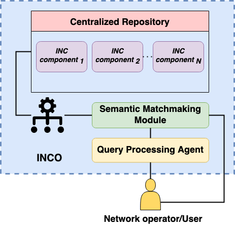
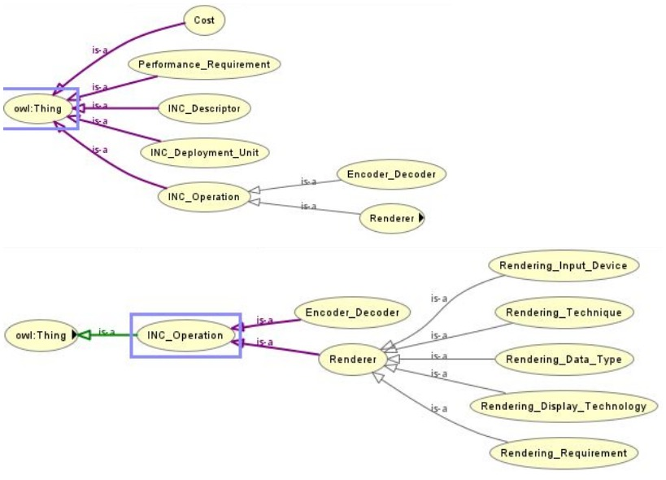
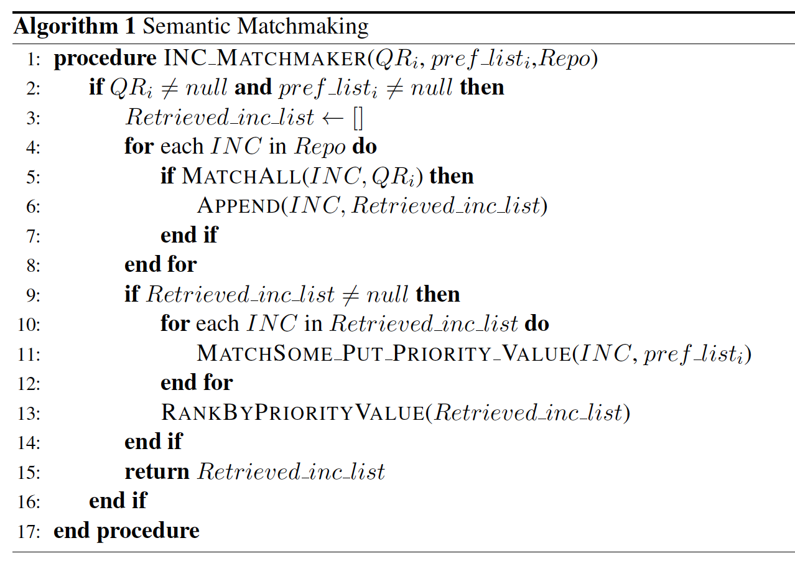

# Ontology-Based Description and Discovery of In-Network Computing (INC) Components

This repository contains the ontology, semantic matching algorithm, example queries, and evaluation results for the project titled:

📄 **An Ontology-Based Model for In-Network Computing Components Description and Discovery**  
Presented at the *2024 International Conference on Network and Service Management (CNSM)*

---

## 📁 Repository Structure

- `INCDescription/` – OWL ontology developed in Protégé
- `INCDiscovery/` – Semantic matcher implementation and discovery logic (in Python/Java)
- `Queries/` – Example SQWRL rules and semantic queries
- `Results/` – Performance evaluation
- `Paper/` – Published paper (PDF)

---

## 🚀 Project Overview

This project aims to enable the semantic description and discovery of In-Network Computing (INC) components for latency-sensitive applications, such as holographic streaming. The system uses an ontology-based model to describe component capabilities — covering both functional and non-functional specifications — and a semantic matchmaker to retrieve contextually relevant resources based on user requirements.

### 🔹 **What is In-Network Computing?
INC refers to executing computing tasks directly within the network — using programmable switches and Smart NICs — rather than relying on distant cloud servers. This reduces latency, minimizes network congestion, and enhances real-time performance, which is essential for applications like Holographic-Type Communication.

### 🔹 **Why Use Ontology?
Ontology provides a formal, machine-readable structure to define and relate domain concepts. It enables semantic annotation, automated service discovery, and reasoning by offering a shared vocabulary. In this project, ontology enhances component description accuracy and allows context-aware matchmaking between service requests and INC resources.

---

## 🖼️ Visual Representations

### 🧩 General Architecture Overview

The architecture comprises several key modules, each fulfilling a distinct role in the INC component discovery pipeline:

- **Centralized Repository**: A database of semantically described INC components.
- **Semantic Matchmaking Module**: Performs ontology-based matching to identify relevant components.
- **Query Processing Agent**: Translates user/operator requirements into actionable semantic queries.
- **User/Network Operator Interface**: Allows specification of preferences and requirements.

This architecture addresses the needs of latency-sensitive, next-generation applications (e.g., holographic communication) through semantic-driven INC component selection.

---

### 🧠 INCO’s Core Concepts

The INCO ontology structures knowledge using a hierarchical class model:

- **Subclasses** inherit properties from their superclasses.
- **Semantic properties** define relationships between concepts.
- **OWL Reasoning** enhances classification and retrieval logic.
- All individuals are ultimately rooted in the universal superclass `owl:Thing`.

---

### 🧬 INCO Decription Model Representation

This entity-relationship-style annotation illustrates:

- **Functional Properties** (blue): Define capabilities of INC components, including ten core functional concepts.
- **Non-Functional Properties** (purple): Represent operational requirements that influence deployment or compatibility.

The model's structure enables precise component description, rich query construction, and efficient semantic retrieval aligned with next-gen application demands.

---

## ⚙️ Discovery of INC Components (Data Retrieval)

### 🔍 INC Component Semantic Matchmaking – Algorithm

**Algorithm 1** outlines the semantic matchmaking process to retrieve and rank INC components from the centralized repository based on user requests and preferences. It proceeds as follows:

- The algorithm ensures that both the query request (`QRi`) and user preference list (`pref listi`) are not null (Line 2).
- The **MatchAll** function is applied to each INC component to check for exact matches to mandatory preferences (Lines 4–6).
- If no components meet all mandatory preferences, the result list remains empty.
- The **MatchSomePutPriorityValue** function then scores the retrieved components based on high/optional preferences (Lines 10–12).
- The **RankByPriorityValue** function orders components by their priority values (Line 13), surfacing the most relevant first.

---

### 🔁 Functional Entity Interaction – Sequence Diagram

This diagram depicts the full sequence of interactions among functional entities during the discovery of suitable INC components for a **holographic streaming** request.

1. **INC Providers** design and publish components in the Centralized Repository.
2. The components are submitted to the **INCO Module** for parsing and semantic enrichment.
3. A **User/Network Operator** submits a streaming request to the **Orchestrator**.
4. The orchestrator sends a component discovery request to the **Query Processing Agent**, which transforms it into a SQWRL query and preference list.
5. The **Semantic Matchmaking Module** receives and executes the query over the ontology.
6. Matching results are ranked and returned to the orchestrator as URIs of relevant INC components.
7. The orchestrator instantiates and places the components, initiates the data flow, and ensures QoS during the session.

This process ensures end-to-end semantic matchmaking and QoS-driven orchestration for next-gen, latency-sensitive applications.

## 🛠️ Tools & Technologies

| Tool             | Purpose                                       |
|----------------  |---------------------------------------------- |
| Protégé 5.6.3    | Ontology modeling                             |
| OWL/SWRL/SQWRL   | Rule and query language for reasoning         |
| Java / Python    | Matcher implementation                        |
| Excel / Charts   | Query performance evaluation and visualization|

---

## 📊 Results

- Enabled accurate, context-driven component discovery
- Response time in matching INC resources based on query complexity and retrived instances
- Scalability of the systen for data retrieval
- Improved semantic flexibility compared to keyword-based systems

> 📈 Full evaluation charts and metrics are available in the `Results/` folder

---
